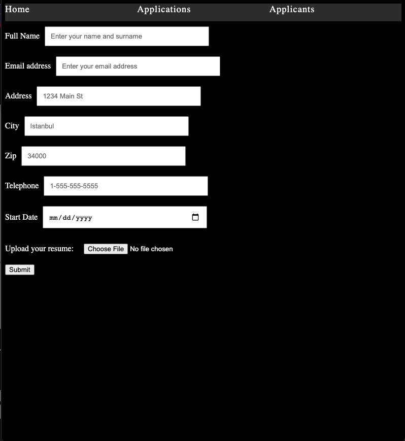
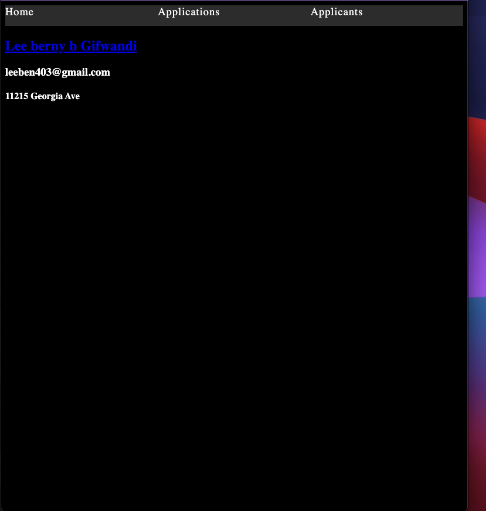

Job Application
-------------------------------------------------------------------------------

It's a job application app which a user can create,read,update and delete data.

Technologies Used
-------------------------------------------------------------------------------

- React
- CSS
- JSX
- Express
- MongoDB/Mongoose
- Node
- Hosted on netlify

Screenshot
-------------------------------------------------------------------------------

Getting Started
-------------------------------------------------------------------------------
 [click here](https://6178b5513c520b000711d358--frosty-carson-03a384.netlify.app/) to see the deployed app!

Unsolved Problems
--------------------------------------------------------------------------------
It doesn't dislay all the entries.

Future Enhancements
-------------------------------------------------------------------------------
I want to be able to include admin features and the ability of a user to log in & log out.I wsano to make it a full CRUD Data Operations.
